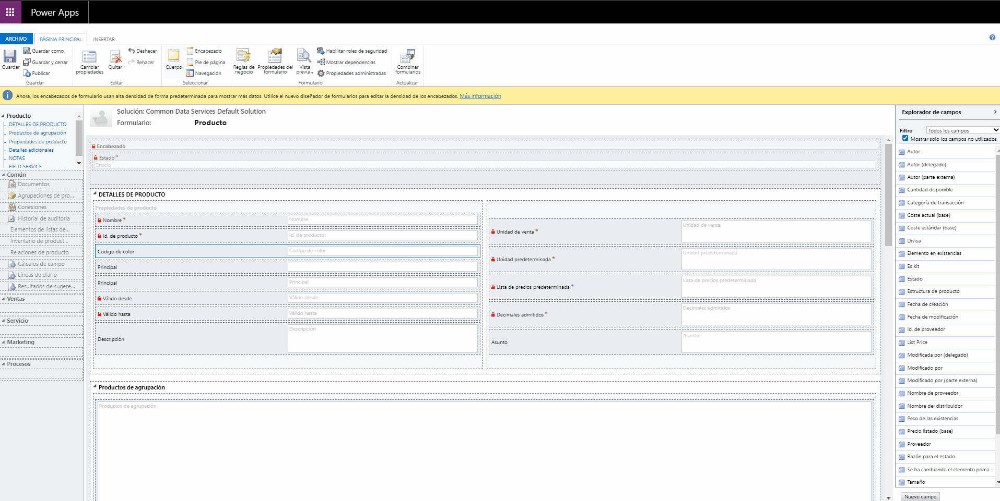
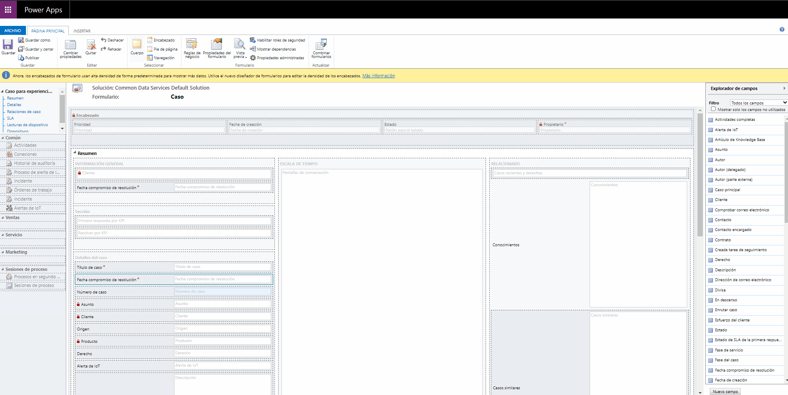

# Daniel Montiel FT-K - PCF Projects
### Español
En este repositorio encontraras algunos de los controles personalizados que he creado usando [Power Apps Component Framework (PCF)](https://docs.microsoft.com/en-us/powerapps/developer/component-framework/overview) + [React](https://en.reactjs.org/) + [Microsoft Fluent UI](https://developer.microsoft.com/en-us/fluentui).
Algunos de estos controles son ejemplos que uso en webinars que presento para enseñar a otros miembros de la comunidad de LATAM a construir sus propios controles personalizados (PCF's)
Estos controles son creatos bajo la  **[MIT License](LICENSE)**

### English
On this repo you will find some of the custom components I have created using the [Power Apps Component Framework (PCF)](https://docs.microsoft.com/en-us/powerapps/developer/component-framework/overview) + [React](https://en.reactjs.org/) + [Microsoft Fluent UI](https://developer.microsoft.com/en-us/fluentui).
Some of these controls are examples that I use on some webinars I deliver to teach to other LATAM Community members to build their own custom controls (PCF's).
This controls are licenced under the **[MIT License](LICENSE)**


# Field - colorPicker/selector de colores

### Español

colorPicker es un control personalizado (PCF) creado para permitir a los usuarios de Power Apps seleccionar colores hexadecimales usando el control colorPicker de la librería [Fluent UI](https://developer.microsoft.com/en-us/fluentui#/controls/web/colorpicker)

### English

colorPicker is a Custom control (PCF) created to allow to the users of Power Apps to select hex colors using the colorPicker component from the [Fluent UI](https://developer.microsoft.com/en-us/fluentui#/controls/web/colorpicker)

Canvas App

Model-driven App



# Field - boundedDatepicker

### Español
boundedDatepicker es un componente personalizado (PCF) creado para permitir a los usuarios de Power Apps usar un selector de fechas con limites configurables haciendo uso del control datePicker de la librería [Fluent UI](https://developer.microsoft.com/es-ES/fluentui#/controls/web/datepicker)

### Parametros
|Nombre|Descripción|Ejemplos|
|-|-|-|
|b_date|El campo donde ocuparemos este control personalizado **PCF** (dateAndTime.DateOnly)|--|
|i_showWeekNumbers|Usa este parametro si quieres activar ver el numero de semana en el selector de fecha.|`Enabled` or `Disabled`|
|i_restrictMinimunDate|Usa este parametro si quieres activar/desactivar el limite de la fecha minima disponible en el selector de fechas en base al valor de **i_minDate**.|`Enabled` or `Disabled`|
|i_minDate|Usa este parametro para definir la fecha minima disponible en el selector de fecha. Puedes usar una fecha fija, mapear algun campo del formularo ó usar numeros **negativos** para definir una fecha dinamica (ej. `-10` -> Hoy- 10 Días)|`2020-01-01` *(dateAndTime.DateOnly)* or `-10` *(whole.None)* |
|i_restrictMaximunDate|Usa este parametro si quieres activar/desactivar el limite de la fecha maxima disponible en el selector de fechas en base al valor de **i_maxDate**.|`Enabled` or `Disabled`|
|i_maxdate|Usa este parametro para definir la fecha minima disponible en el selector de fecha. Puedes usar una fecha fija, mapear algun campo del formularo ó usar numeros **positivos** para definir una fecha dinamica (ej. `10` -> Hoy + 10 Días)|`2020-12-31` *(dateAndTime.DateOnly)* or `10` *(whole.None)* |


### English

bounded
boundedDatepicker es un componente personalizado (PCF) creado para permitir a los usuarios de Power Apps usar un selector de fechas con limites configurables haciendo uso del control datePicker de la librería [Fluent UI](https://developer.microsoft.com/es-ES/fluentui#/controls/web/datepicker)

### Properties
|Name|Description|Example|
|-|-|-|
|b_date|The field on what you will use this **PCF** (dateAndTime.DateOnly)|--|
|i_showWeekNumbers|Use this parameter if you want to see the week number on the datepicker Control.|`Enabled` or `Disabled`|
|i_restrictMinimunDate|Use this parameter to enable/disable the minimun date limit on the datepicker control based on the value of **i_minDate**.|`Enabled` or `Disabled`|
|i_minDate|Use this parameter to set the minimun available date. You can use a fixed date, map to a field or use **negative** numbers to define a dynamic date (ie. -10 -> today - 10 Days)|`2020-01-01` *(dateAndTime.DateOnly)* or `-10` *(whole.None)* |
|i_restrictMaximunDate|Use this parameter to enable/disable the minimun date limit on the datepicker control based on the value of **i_maxDate**.|`Enabled` or `Disabled`|
|i_maxdate|Use this parameter to set the minimun available date. You can use a fixed date, map to a field or use **positive** numbers to define a dynamic date (ie. 10 -> today + 10 Days)|`2020-12-31` *(dateAndTime.DateOnly)* or `10` *(whole.None)* |


Model-driven App



## How to use...

### Test components
 1. Install all the required software
 2. Clone this repository to your local computer
 3. Open the repository folder and go to PCF_Projects. You will find the PCF projects divided on `dataSet` and `field` folders.
 4. Open the PCF Project you want to test ie:`PCF_Projects/Field/boundedDatePicker/`
 5. To retrieve all the required project dependencies, run the command: `npm install`
 6. Run the test environment by using the command `npm start`
 or `npm start watch`  

### Package a the component
Follow the instructions provided in [docs.microsoft.com](https://docs.microsoft.com/en-us/powerapps/developer/component-framework/import-custom-controls) and open the **Visual Studio Developer Command Prompt** in folder `"PCF_Projects/PCF_Solutions/"`

Run the command:
```cmd

msbuild /t:build /restore 

```
It will create a **unmanaged solution** in `"PCF_Projects/PCF_Solutions/bin/Debug/"` directory
  *or*
```cmd

msbuild /t:build /restore /p:configuration=Release

```
if you want to create a **managed solution**  in `"PCF_Projects/PCF_Solutions/bin/Release/"` directory


To install the component in your solution [connect your environment](https://docs.microsoft.com/en-us/powerapps/developer/component-framework/import-custom-controls#connecting-to-your-environment).